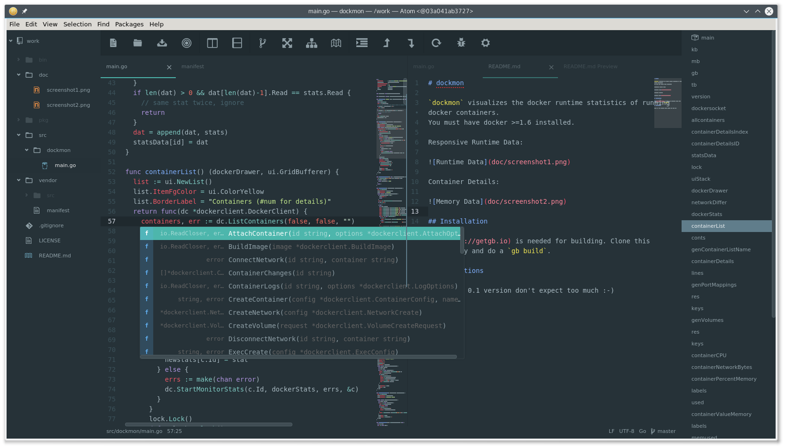

# atocker
Atom 1.5 Editor with go-tools bundled in Docker.



This docker image contains [atom](http://atom.io), [go-plus](https://github.com/joefitzgerald/go-plus)  and many go tools. The configuration conforms to
[gb](http://getgb.io/), so your project directory should conform to [this](http://getgb.io/docs/project/) layout. You can start the editor in an empty
directory and the needed directories will be created to develop with `gb` (a `src` and a `vendor` directory). You should have `gb` installed on your
system to build your software: simply open a second shell and type `gb build`. Make sure to create the correct [directory layout](http://getgb.io/docs/project/)!

You can start the editor in the project directory with `atocker`.

Please note: When using the given start script (or alias) the settings and plugins of the editor will be stored in your
`$HOME/.config/atocker/<workspacepath>` directory. All plugins will be in your `$HOME/.config/atocker/.atom/packages` folder. 

[](https://quay.io/repository/ulrichschreiner/atocker)

Use the given `atocker` script to start an instance or create an alias:

```
_atocker() {
  docker run  \
    --rm \
    -it \
    -v /etc/localtime:/etc/localtime:ro \
    -v /tmp/.X11-unix:/tmp/.X11-unix \
    -v `pwd`:/work \
    -v $HOME/.config:/config \
    -v $HOME/.gitconfig:/devhome/.gitconfig \
    -v $SSH_AUTH_SOCK:/ssh-agent --env SSH_AUTH_SOCK=/ssh-agent \
    --device /dev/dri \
    -e DISPLAY=$DISPLAY \
    -e LANG=$LANG \
    -e HOSTUSER=`id -un` \
    -e HOSTGROUP=`id -gn` \
    -e HOSTUSERID=`id -u` \
    -e HOSTGROUPID=`id -g` \
    -e WORKSPACE=`pwd` \
    quay.io/ulrichschreiner/atocker "$1"
}
alias gbatom=_atocker
alias atm="_atocker plain"
```
Note: If you have private repositories where you need your SSH keys, start an agent before starting `atocker` and add your keys with `ssh-add`. The agent will be forwarded to the container so the tools to pull inside of atom will work.

Now you can use `gbatom` to start an atom editor where the needed filesystem layout will be created if it does not exist. You can also use `atm` to start a Atom editor in the current working directory without creating `src` and `vendor/src` directories.

## Included Plugins

- [blame](https://atom.io/packages/blame)
- [file-icons](https://atom.io/packages/file-icons)
- [git-control](https://atom.io/packages/git-control)
- [git-history](https://atom.io/packages/git-history)
- [git-log](https://atom.io/packages/git-log)
- [git-plus](https://atom.io/packages/git-plus)
- [go-find-references](https://atom.io/packages/go-find-references)
- [go-plus](https://atom.io/packages/go-plus)
- [go-rename](https://atom.io/packages/go-rename)
- [language-docker](https://atom.io/packages/language-docker)
- [language-protobuf](https://atom.io/packages/language-protobuf)
- [merge-conflicts](https://atom.io/packages/merge-conflicts)
- [minimap](https://atom.io/packages/minimap)
- [minimap-bookmarks](https://atom.io/packages/minimap-bookmarks)
- [minimap-find-and-replace](https://atom.io/packages/minimap-find-and-replace)
- [react](https://atom.io/packages/react)
- [symbols-tree-view](https://atom.io/packages/symbols-tree-view)
- [tool-bar](https://atom.io/packages/tool-bar)
- [tool-bar-almighty](https://atom.io/packages/too-bar-almighty)

Please note: For `git` you need your correct git configuration. In my example i mount my `$HOME/.gitconfig` into the container.

## See also
If you don't like atom, you should give  [Visual Studio Code](https://github.com/ulrichSchreiner/vsc) a try.
